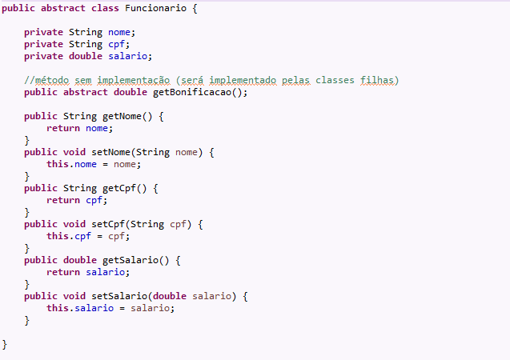
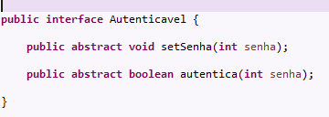
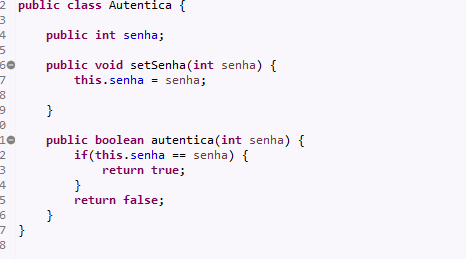
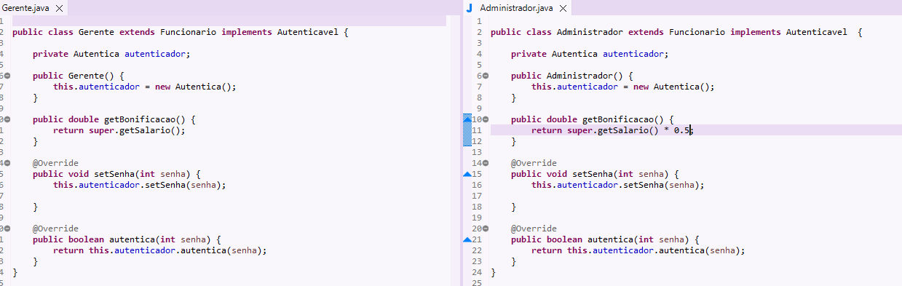
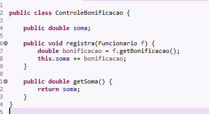
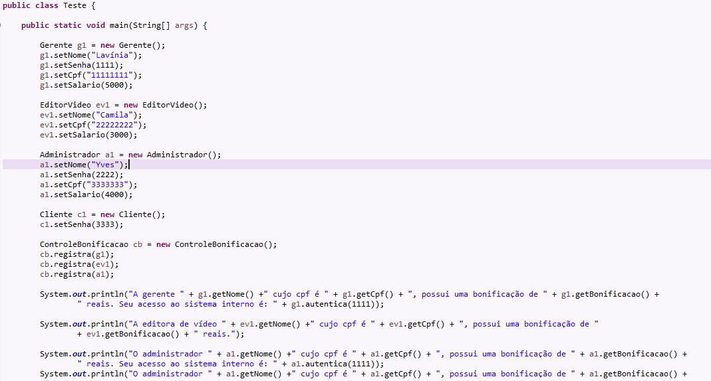
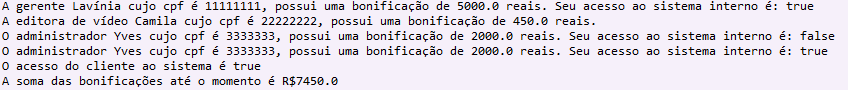

<h1 align="center"> BYTEBANK </h1>

Projeto desenvolvido através do curso "Java Polimorfismo: entenda herança e interfaces" pela plataforma Alura. 
 

 

  <a href="#-sobre-o-projeto">Sobre o projeto</a>&nbsp;&nbsp;&nbsp;|&nbsp;&nbsp;&nbsp; 
  <a href="#-explicacao">Explicação</a>&nbsp;&nbsp;&nbsp;|&nbsp;&nbsp;&nbsp;
  <a href="#-tecnologias">Tecnologias</a>&nbsp;&nbsp;&nbsp;&nbsp;&nbsp;&nbsp;

 

# 💻 Sobre o projeto

Bytebank é um projeto realizado durante os cursos de introdução à Java e Orientação a Objetos, com o intuito de praticar e fixar conhecimentos acerca de herança e
polimorfismo, além da utilização e manejo de interfaces e métodos abstratos.

# 📝 Explicação

Classe abstrata Funcionário

</img>

Interface com os métodos de autenticação para usuários que obterão acesso ao sistema interno da empresa

</img>
 

Classe com os métodos de autenticação implementados para evitar repetição de código

</img>
 

Classes que especificam os tipos de funcionários e extendem a classe mãe, implementandos os métodos necessários

</img>
 

Classe que realiza o controle das bonificações, calculando o total a ser repassado para distribuição devida aos funcionários

</img>
 

Classe que executa os testes do projeto

</img>
 

Resultado que deve ser imprimido na tela

</img>
 

  

## 🚀 Tecnologias

Esse projeto foi desenvolvido com as seguintes tecnologias:
- Java

# Autor

Lavínia Souza Silveira

https://www.linkedin.com/in/lav%C3%ADnia-silveira-896b2624a/
